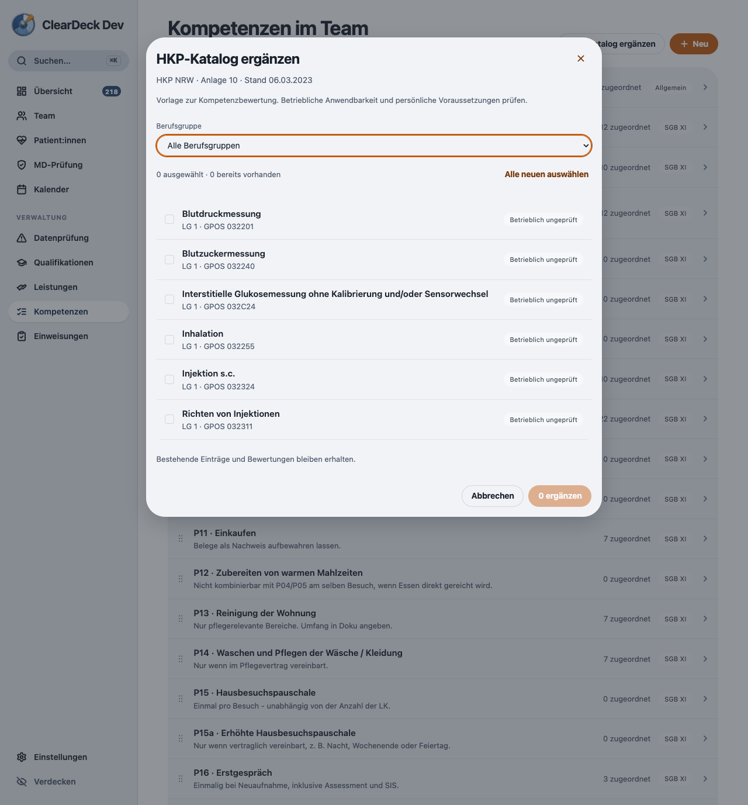
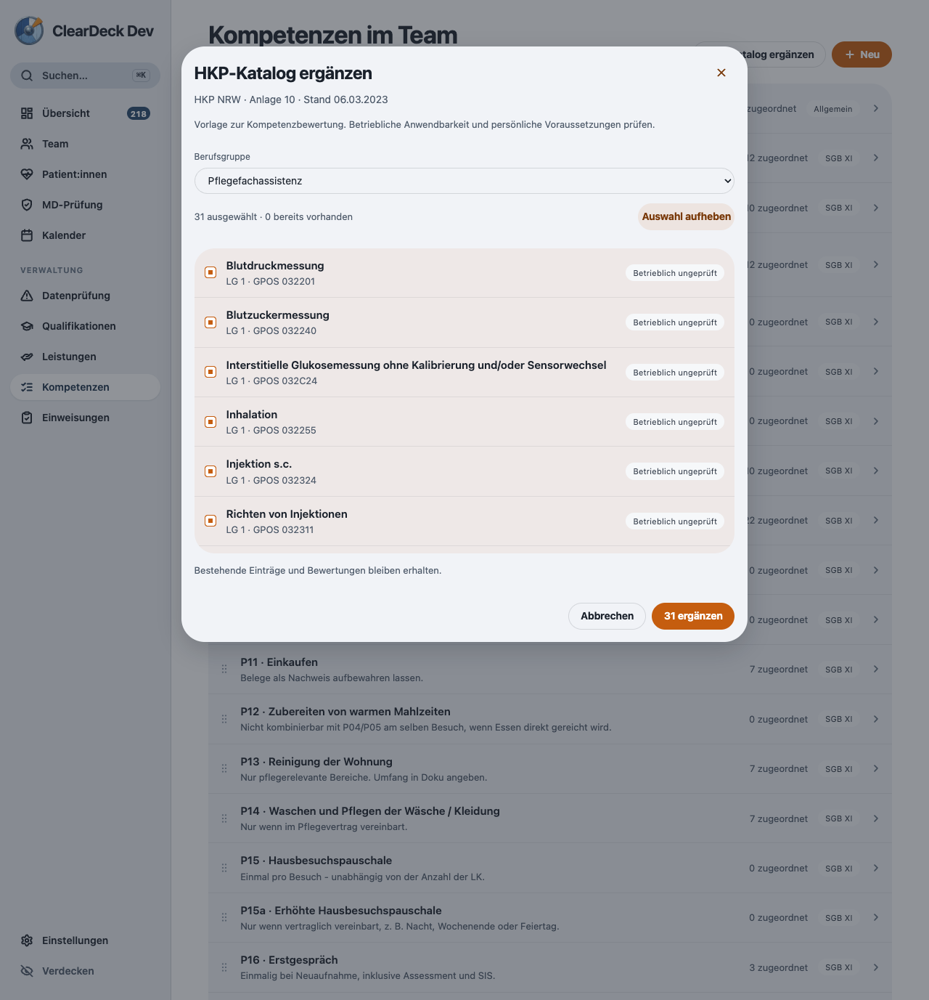
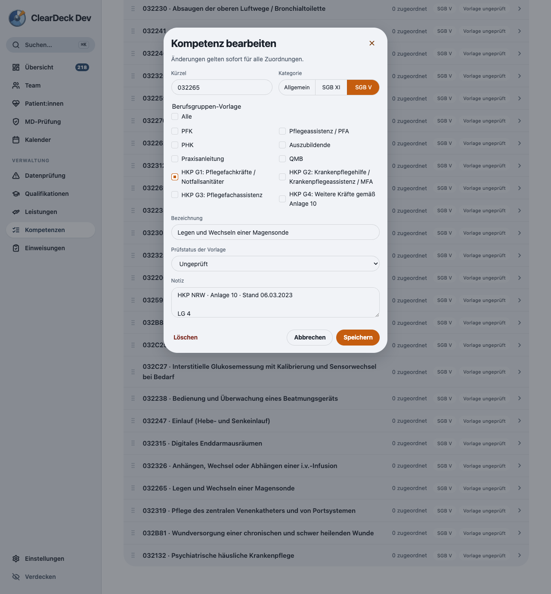

# HKP-Katalog: Prüfung vom 22.09.2026

Die Original-PDF der Anlage 10 vom 06.03.2023 wurde vollständig gelesen und auf allen drei gerenderten Seiten geprüft. Die 50 GPOS-Kennungen wurden unabhängig aus dem PDF-Text extrahiert und mit dem Katalog verglichen: keine fehlenden oder zusätzlichen Kennungen. [Quelle und fachlicher Abgleich](../../fachwissen/kompetenzmatrix-foto-katalogabgleich.md).

## Automatisierte Prüfung

- 101 Testdateien, 687 Tests erfolgreich.
- TypeScript ohne Fehler, ESLint ohne Fehler.
- Server einschließlich beider PostgreSQL-Integrationstests: 11 erfolgreich, keine übersprungen.
- Geprüft: Migration bestehender Daten, wiederholter Import, Erhalt lokaler Katalogänderungen und persönlicher Bewertungen, spätere Bearbeitung, ungültige Auswahl ohne Teilimport, vier Berufsgruppen, Bestandsschutz-Hinweise, Mehrfachauswahl, Fehler beim Speichern und Synchronisierung von Herkunft und Prüfstatus.
- Ein paralleler Testlauf zusammen mit TypeScript, ESLint und Electron überschritt bei einem UI-Test das 5-Sekunden-Limit. Der anschließende vollständige Lauf ohne diese parallele Last bestand unverändert mit allen 687 Tests.

## Prüfung in der App

Echte Electron-App aus diesem Arbeitsstand, ausschließlich synthetisches Demoprofil. Bedienung und Screenshots über Playwright/CDP.

- Vorschau aller 50 Positionen; Import erst nach ausdrücklicher Auswahl.
- Filter Pflegefachassistenz: 31 Positionen, kein Wechsel einer s.c.-Infusion.
- 50 Positionen übernommen; beim erneuten Öffnen 50 bereits vorhanden und keine erneut auswählbar.
- Magensonde bearbeitet, Prüfstatus gespeichert; Vorlagenkennung, ID und Berufsgruppe erhalten.
- Keine neuen Konsolenfehler. Die vorhandene Font-CSP-Meldung und Electron-Entwicklungswarnung bleiben unverändert.

## Veröffentlichung

Dieser Stand veröffentlicht keinen neuen Installer und führt keinen Server-Rollout aus. Die Schemaänderung auf Version 24 muss beim späteren Release mit dem Sync-Server abgestimmt werden. Die aktuelle Vertragsgeltung beim konkreten Dienst und persönliche Nachweise werden durch den Katalogimport nicht bestätigt.
