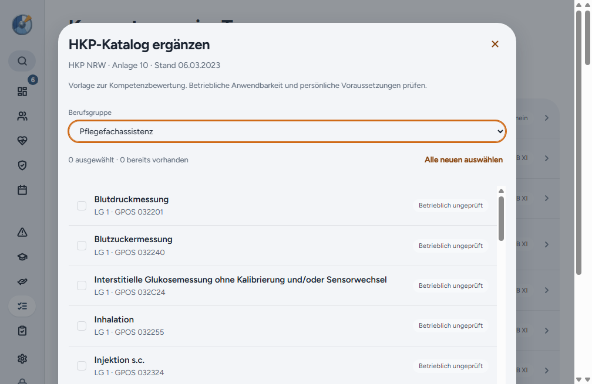

# Windows-Release 2.4.0

Der Release ergänzt den HKP-Katalog aus Anlage 10 vom 06.03.2023 um 50 Positionen, vier Berufsgruppen und sieben Fußnoten. Import und spätere Bearbeitung erhalten lokale Einträge und persönliche Bewertungen. Fachlicher Abgleich und Originalquelle stehen in [der Katalogdokumentation](../../fachwissen/kompetenzmatrix-foto-katalogabgleich.md).

PR #56 wurde als `fd9fb22d57c697a516bbe27429eca93168ba8f91` übernommen. PR #57 bereitet den Windows-Release vor. Die aktuelle Vertragsgeltung beim konkreten Dienst bleibt eine betriebliche Prüfung. Synchronisierte Installationen benötigen zuerst den aktualisierten Server mit Schema 24; dieser Desktop-Release führt kein Serverdeployment aus.

## Kandidatenprüfung

Der erste Lauf 35778929168 scheiterte zunächst beim Rekonstruieren der alten Testversion 2.1.0: Ein unvollständig entferntes optionales Mac-Paket ließ den bestehenden Postinstall-Schritt auf Windows fehlschlagen. Derselbe Job bestand unverändert auf einem frischen Runner. Anschließend erreichten alle fünf Updatewege das Zielprogramm, scheiterten jedoch am zusätzlich eingeführten UI-Test. Er suchte „Kompetenzen“ noch innerhalb der separaten Einstellungsnavigation. Der Test verlässt jetzt zuerst die Einstellungen über „Zurück“. Keine Prüfung wurde entfernt oder abgeschwächt.

Der endgültige Kandidatencommit ist `8c339be72cf670d107f4cdd04f6023a750112001`. Der vollständige [Kandidatenlauf 35780573207](https://github.com/tbuck-software/cleardeck/actions/runs/35780573207) bestand auf diesem unveränderten Commit.

Die nativen Tests verwenden synthetische verschlüsselte Profile und prüfen Passwort, Schlüssel, alle bestehenden Tabellen und Einstellungen sowie Benutzerpräferenzen über zwei Starts. Ausgangsversionen bis 2.3.0 erhalten eine automatische Migrationssicherung für Schema 24. Das Folgeupdate aus 2.4.0 erwartet keine neue Sicherung und vergleicht auch eine bestehende HKP-Vorlage mit eigener Notiz und betrieblichem Prüfstatus.

2.1.0 wird aus dem bereinigten Originaltag rekonstruiert, da der Originalinstaller fehlt. 2.2.0, 2.2.1 und 2.3.0 verwenden die archivierten Originalinstaller mit SHA-256-Prüfung. 2.4.1 ist ausschließlich eine Testversion.

## Veröffentlichung und Rückprüfung

[Release v2.4.0](https://github.com/tbuck-software/cleardeck/releases/tag/v2.4.0) wurde am 22.09.2026 um 20:49 UTC veröffentlicht und ist der aktuelle stabile Release. Das Repository bleibt privat. Ausgeliefert werden ausschließlich die fünf Windows-Dateien, keine neuen Mac- oder Linux-Pakete.

[PR #57](https://github.com/tbuck-software/cleardeck/pull/57) ist auf main übernommen. Der Tag zeigt auf den unveränderten geprüften Kandidatencommit. Der [Veröffentlichungslauf 35781578230](https://github.com/tbuck-software/cleardeck/actions/runs/35781578230) bestand vollständig im ersten Versuch.

| Ausgangspunkt | Weg | Ziel | Kandidat und Veröffentlichung |
| --- | --- | --- | --- |
| 2.1.0 | Installer über vorhandene App | 2.4.0 | Bestanden |
| 2.2.0 | Installer über vorhandene App | 2.4.0 | Bestanden |
| 2.2.1 | Download und Installation aus der App | 2.4.0 | Bestanden |
| 2.3.0 | Download und Installation aus der App | 2.4.0 | Bestanden |
| 2.4.0 | Folgeupdate aus der App | 2.4.1, nur Testversion | Bestanden |

Alle fünf veröffentlichten Dateien wurden zurückgeladen. Ihre SHA-256-Werte stimmen exakt mit dem getesteten Tag-Build und den GitHub-Digests überein. Der lokale Verifier prüfte erneut Paketinhalt, Update-Referenzen, Größen, SHA-512 und öffentliche/private Update-Provider. Der neue Release-Notes-Abschnitt in `latest.yml` entspricht dem Changelog. Die Windows-Datei ist lokal unter `~/Downloads/ClearDeck-2.4.0/ClearDeck-2.4.0-Setup.exe` samt SHA-256-Datei abgelegt.

Nachweise: [Kandidatenlauf](assets/2026-09-22-release-2.4.0/candidate-run.json), [Veröffentlichungslauf](assets/2026-09-22-release-2.4.0/tag-run.json), [Live-Prüfung](assets/2026-09-22-release-2.4.0/live-verification.json), [Hashvergleich](assets/2026-09-22-release-2.4.0/live-hashes.json), [Releasezustand](assets/2026-09-22-release-2.4.0/live-release.json). Native Ergebnisdateien liegen unter `candidate/` und `published-build/` im selben Nachweisordner.

[Issue #33](https://github.com/tbuck-software/cleardeck/issues/33) wurde aktualisiert und als umgesetzt geschlossen. Die offene betriebliche Vertragsklärung bleibt darin ausdrücklich dokumentiert. Der ältere Entwurf [PR #53](https://github.com/tbuck-software/cleardeck/pull/53) wurde als durch #56 ersetzt geschlossen. Keine Nachricht an Ole versendet, kein Test auf seinem Gerät und kein Serverdeployment durchgeführt.
