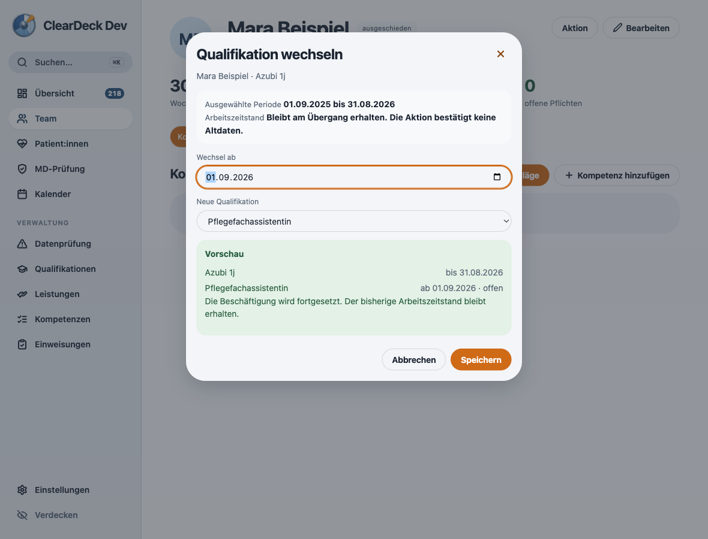
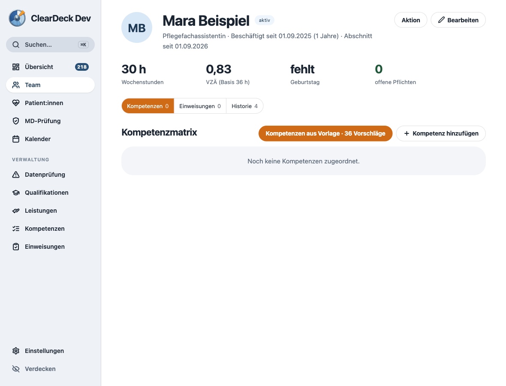

# Qualifikationswechsel am unmittelbaren Folgetag

Der Dialog und die Speicherung begrenzten das Wechseldatum auf den bestehenden Beschäftigungszeitraum. Ein zum 31.08.2026 beendeter Ausbildungsabschnitt konnte deshalb nicht ab 01.09.2026 fortgeführt werden. Der Dialog schlug stattdessen den letzten Tag des alten Abschnitts vor.

Der unmittelbare Folgetag ist jetzt zusätzlich zulässig. Die alte Qualifikation und ihr Enddatum bleiben erhalten; die neue Qualifikation beginnt ohne Enddatum am Folgetag. Die Vorschau benennt die Fortsetzung ausdrücklich. Änderungen innerhalb eines bestehenden Abschnitts behalten weiterhin dessen bisheriges Enddatum.

Der letzte gültige Arbeitszeitstand einschließlich Prüfstatus und Herkunft wird übernommen. Die Person behält ihre ID, Bewertungen und Historie. Schon vorhandene Folgezeiträume, Überschneidungen, größere Lücken oder widersprüchliche Arbeitszeitdaten werden nicht stillschweigend geändert. Konflikte brechen die Transaktion ohne Teiländerung ab.

## Prüfung

- Fehler vor der Korrektur durch Tests für Dialog und Repository nachgestellt.
- 697 Tests in 101 Dateien erfolgreich, davon 25 gezielte Tests für Beschäftigungsaktionen, Dialog und Auswahlaktualisierung.
- Neue Fälle umfassen Ausbildungsende, Jahreswechsel, Schaltjahr, eintägigen Abschnitt, unveränderte Bewertungen und historische Arbeitszeitdaten, wiederholtes Speichern, vorhandene Folgezeiträume, Lücken und Arbeitszeitdaten außerhalb des alten Abschnitts.
- TypeScript und ESLint ohne Fehler.
- In der echten Electron-Demo mit synthetischer Person gespeichert: Azubi bis 31.08.2026, Pflegefachassistentin ab 01.09.2026, aktive Person, 30 Wochenstunden und 0,83 VZÄ erhalten. Die gespeicherten Perioden wurden zusätzlich über die App-API geprüft.
- Keine neuen Laufzeitfehler. Bestehende Font-CSP-Meldung und Electron-Entwicklungswarnung sind unverändert.

Keine Datenmigration oder neue Server-Schemaversion erforderlich. Dieser Änderungsstand ist noch kein veröffentlichtes Update.

