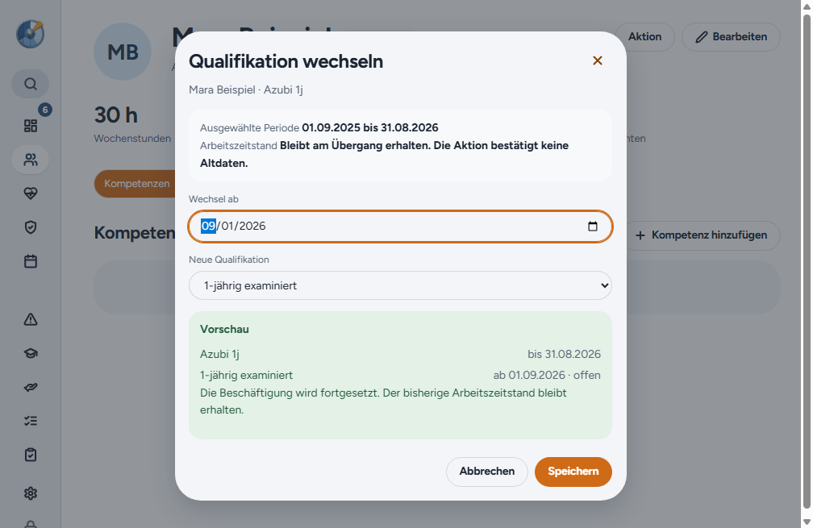
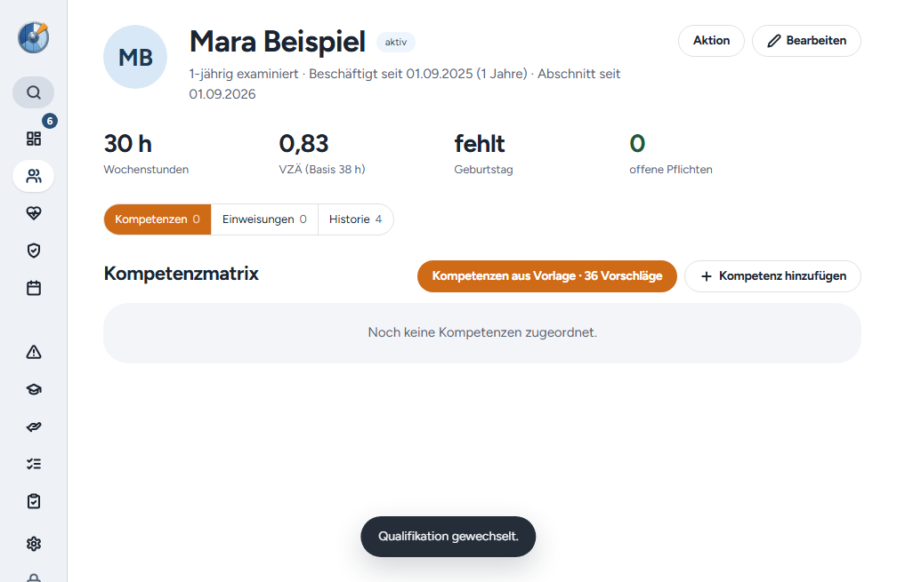

# Windows-Release 2.4.1

Der Release korrigiert den Qualifikationswechsel direkt nach einem beendeten Beschäftigungsabschnitt. Eine Ausbildung bis 31.08.2026 lässt sich ab 01.09.2026 mit neuer Qualifikation fortsetzen. Der alte Abschnitt bleibt erhalten, die neue Beschäftigung ist offen und übernimmt den letzten gültigen Arbeitszeitstand. Bestehende Folgezeiträume und widersprüchliche Altdaten werden weiterhin als Konflikt behandelt.

[PR #59](https://github.com/tbuck-software/cleardeck/pull/59) ist mit `36cd3788c6199fe77e7dae3b700962852ed9aac1` auf main übernommen. [PR #60](https://github.com/tbuck-software/cleardeck/pull/60) bereitet den Release vor. Schema 24 bleibt unverändert. Für bestehende 2.4.0-Installationen ist keine neue Datenmigration oder Server-Schemaversion erforderlich.

## Prüfung

Die Codeprüfungen umfassen TypeScript, ESLint und die vollständige Testsuite. Sechs native Windows-Wege prüfen Installation bzw. Download und Installation aus der App, das bisherige Passwort, verschlüsselte Konfiguration und Schlüssel, bestehende Datensätze, Einstellungen und Benutzerpräferenzen über zwei Starts.

2.1.0 wird aus dem bereinigten Originaltag rekonstruiert, da der Originalinstaller fehlt. 2.2.0, 2.2.1, 2.3.0 und 2.4.0 verwenden die archivierten Originalinstaller mit geprüftem SHA-256. Der Nachfolger 2.4.2 dient ausschließlich dem Folgeupdatetest und wird nicht veröffentlicht. Ausgangsversionen vor 2.4.0 erhalten eine Migrationssicherung für Schema 24; spätere Versionen benötigen keine zusätzliche Sicherung.

Erst nach den unveränderten Datenvergleichen wird eine synthetische Person angelegt und ihr Qualifikationswechsel durch den sichtbaren Dialog gespeichert. Geprüft werden Ausbildungsende 31.08.2026, neuer Beginn 01.09.2026 ohne Enddatum, dieselbe Person sowie unveränderte 30 Wochenstunden und 0,83 VZÄ. Die vorherigen Bestandserhaltungsprüfungen bleiben davon getrennt.

| Ausgangspunkt | Weg | Ziel |
| --- | --- | --- |
| 2.1.0 | Installer über vorhandene App | 2.4.1 |
| 2.2.0 | Installer über vorhandene App | 2.4.1 |
| 2.2.1 | Update aus der App | 2.4.1 |
| 2.3.0 | Update aus der App | 2.4.1 |
| 2.4.0 | Update aus der App | 2.4.1 |
| 2.4.1 | Folgeupdate aus der App | 2.4.2, nur Testversion |

Der unveränderte Kandidatencommit `416e10374f3da7c96d98d54148ed130d76298f2c` bestand den vollständigen [Kandidatenlauf 35831609153](https://github.com/tbuck-software/cleardeck/actions/runs/35831609153) im ersten Versuch. PR #60 wurde mit `cb55249aa9cb4cc53b25e5410a579f8159447433` gemergt. Der Tag v2.4.1 zeigt auf den geprüften Kandidatencommit.

## Veröffentlichung und Rückprüfung

[Release v2.4.1](https://github.com/tbuck-software/cleardeck/releases/tag/v2.4.1) wurde am 23.09.2026 um 07:46 UTC veröffentlicht. Der [Veröffentlichungslauf 35832420230](https://github.com/tbuck-software/cleardeck/actions/runs/35832420230) bestand vollständig im ersten Versuch. Alle sechs Updatewege und die anschließenden Qualifikationswechsel bestanden sowohl im Kandidatenlauf als auch im Veröffentlichungslauf.

Alle fünf veröffentlichten Dateien wurden erneut heruntergeladen. Ihre SHA-256-Werte stimmen mit dem getesteten Tag-Build und den GitHub-Digests überein. Der lokale Verifier bestätigte Paketinhalt, Referenzen, Größen, SHA-512 und öffentliche/private Update-Provider. Die Release Notes in GitHub und im Update-Manifest entsprechen dem Changelog. Der Release ist stabil, kein Entwurf und als aktuell markiert.

Der Windows-Installer liegt unter `~/Downloads/ClearDeck-2.4.1/ClearDeck-2.4.1-Setup.exe` samt `SHA256SUMS.txt`. Ausgeliefert werden ausschließlich Windows-Dateien. Das Repository bleibt privat; Updates aus der App benötigen den eingerichteten GitHub-Zugriff. Kein neues Mac- oder Linux-Paket, kein Serverdeployment und kein Test auf Oles Gerät.

Nachweise: [Kandidatenlauf](assets/2026-09-23-release-2.4.1/candidate-run.json), [Veröffentlichungslauf](assets/2026-09-23-release-2.4.1/tag-run.json), [Live-Prüfung](assets/2026-09-23-release-2.4.1/live-verification.json), [Hashvergleich](assets/2026-09-23-release-2.4.1/live-hashes.json), [Releasezustand](assets/2026-09-23-release-2.4.1/live-release.json). Native Ergebnisdateien für Datenübernahme und Qualifikationswechsel liegen unter `candidate/` und `published-build/` im selben Nachweisordner.

