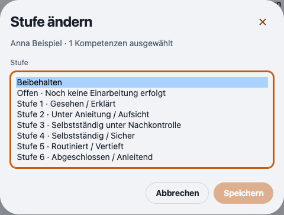
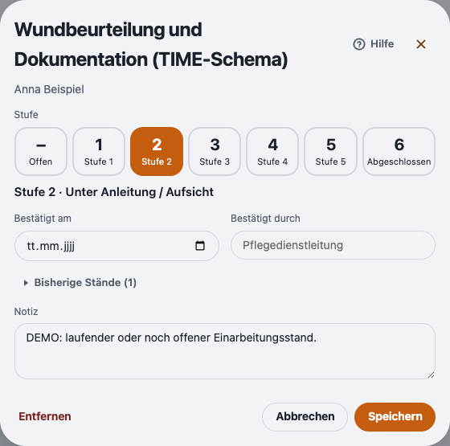

# Bedeutung der Einarbeitungsstufen anzeigen

Rückmeldung vom 07.10.2026: Im Dialog **Stufe ändern** hießen die Stufen 1 bis 5 nur „Einarbeitung“; die Zuordnung war in der Praxis unklar.

Das aktuelle Modell hat jetzt feste Bedeutungen je Stufe (`COMPETENCY_LEVEL_DESCRIPTIONS`):

| Stufe | Bedeutung |
| --- | --- |
| Offen | Noch keine Einarbeitung erfolgt |
| 1 | Gesehen / Erklärt |
| 2 | Unter Anleitung / Aufsicht |
| 3 | Selbstständig unter Nachkontrolle |
| 4 | Selbstständig / Sicher |
| 5 | Routiniert / Vertieft |
| 6 | Abgeschlossen / Anleitend |

- **Stufe ändern** zeigt die Bedeutung direkt in der Auswahl, auch unter „Neu einschätzen“ bei Altmodell-Einträgen.
- Das Stufenfeld der Einzelbearbeitung nennt die Bedeutung der gewählten Stufe darunter; jede Schaltfläche hat sie als Tooltip.
- Der Stufen-Tag in der Kompetenzliste trägt sie als Tooltip.
- Kurzlabels, gespeicherte Werte und das Altmodell bleiben unverändert. Stufe 6 verlangt weiter Bestätigungsdatum und Person; „Anleitend“ ist keine eigene Berechtigung.

Die Bezeichnungen sind bewusst fest hinterlegt und nicht konfigurierbar, damit Verlauf, Export und Anleitung dieselbe Bedeutung zeigen.

## Prüfung

- 707 Tests in 102 Dateien erfolgreich (Node 26.8.2), davon drei neu.
- TypeScript und ESLint ohne Fehler.
- Echte Electron-Demo mit synthetischen Daten. Die Auswahl ist für den Screenshot aufgeklappt dargestellt; in der App ist sie ein normales Auswahlfeld.

