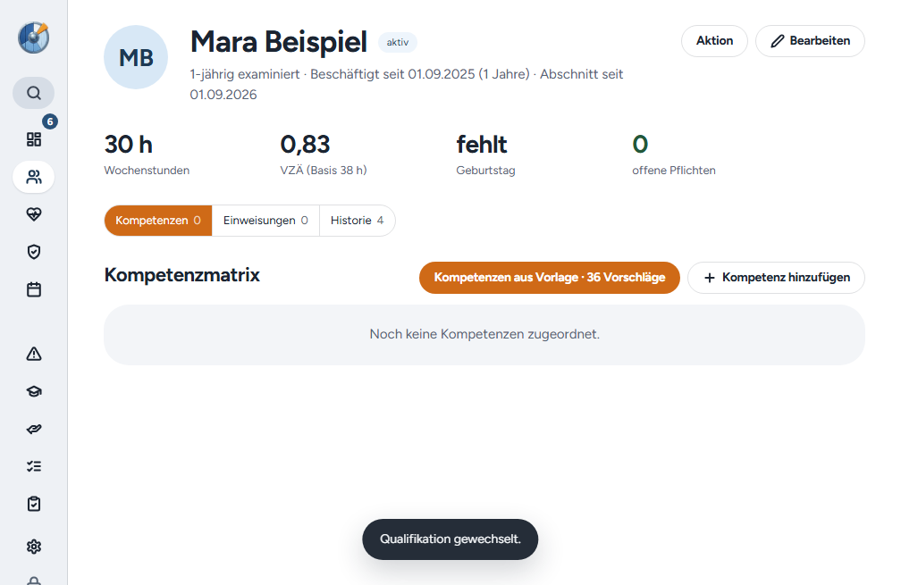

# Windows-Release 2.5.0

Der Release bündelt PR #62 bis #64: Teilgruppe im Patientenformular hervorgehoben und bei ungeprüfter Einstufung „vorläufig“, Neueinschätzung von Kompetenzen aus dem Altmodell, Bezeichnungen der Einarbeitungsstufen und Auszubildende außerhalb der VZÄ-Gesamtsumme. [PR #65](https://github.com/tbuck-software/cleardeck/pull/65) bereitet den Release vor.

Die Datenbank steigt auf Schema 25 (`employment_periods.excludeFromFteTotal`, ohne Rückbefüllung). Die Sync-Schemaversion ist ebenfalls 25. Bei Synchronisierung muss zuerst der Sync-Server, danach jeder Arbeitsplatz aktualisiert werden. Ein Serverdeployment gehört nicht zu diesem Release.

## Prüfung

Die Codeprüfungen umfassen TypeScript, ESLint und die vollständige Testsuite. Sieben native Windows-Wege prüfen Installation bzw. Update aus der App, das bisherige Passwort, verschlüsselte Konfiguration und Schlüssel, bestehende Datensätze, Einstellungen und Benutzerpräferenzen über zwei Starts. Alle Ausgangsversionen vor 2.5.0 migrieren auf Schema 25 und erhalten genau eine Migrationssicherung.

Das GitHub-Release v2.2.0 samt Originalinstaller ist nicht mehr vorhanden; eine lokale Kopie gibt es nicht. 2.2.0 wird deshalb wie 2.1.0 aus dem Originaltag ohne Zugangsdaten rekonstruiert. 2.2.1, 2.3.0, 2.4.0 und 2.4.1 verwenden die Originalinstaller mit archivierter SHA-256. Der Nachfolger 2.5.1 dient ausschließlich dem Folgeupdatetest und wird nicht veröffentlicht.

Nach den Bestandsvergleichen legt der Test eine synthetische Auszubildende mit VZÄ-Ausnahme an und wechselt ihre Qualifikation über den sichtbaren Dialog. Geprüft werden: Ausnahme gespeichert, Anteil außerhalb der Gesamtsumme, Ausbildungsabschnitt bleibt ausgenommen, Folgeabschnitt zählt wieder mit, unveränderte 30 Wochenstunden und 0,83 VZÄ.

| Ausgangspunkt | Weg | Ziel |
| --- | --- | --- |
| 2.1.0, rekonstruiert | Installer über vorhandene App | 2.5.0 |
| 2.2.0, rekonstruiert | Installer über vorhandene App | 2.5.0 |
| 2.2.1 | Update aus der App | 2.5.0 |
| 2.3.0 | Update aus der App | 2.5.0 |
| 2.4.0 | Update aus der App | 2.5.0 |
| 2.4.1 | Update aus der App | 2.5.0 |
| 2.5.0 | Folgeupdate aus der App | 2.5.1, nur Testversion |

Der Kandidatencommit `4c1d9142ce63e0f25dc0ee82446290a9bbbafb8c` bestand den [Kandidatenlauf 37664445476](https://github.com/tbuck-software/cleardeck/actions/runs/37664445476) im zweiten Versuch. Im ersten Versuch brach der Weg ab 2.3.0 in `npm ci` beim Electron-Download (HTTP 500) ab, vor jedem Test. Ein vorheriger Lauf auf `fd8ea6f` scheiterte nur am fehlenden 2.2.0-Originalinstaller.

## Veröffentlichung und Rückprüfung

[Release v2.5.0](https://github.com/tbuck-software/cleardeck/releases/tag/v2.5.0) wurde am 07.10.2026 um 18:38 UTC veröffentlicht. Der [Veröffentlichungslauf 37666257918](https://github.com/tbuck-software/cleardeck/actions/runs/37666257918) bestand im zweiten Versuch. Im ersten Versuch brachen die Wege ab 2.2.1 und 2.4.1 in `npm ci` ab (Electron-Download-Timeout bzw. unvollständige Installation), vor jedem Test; die Veröffentlichung wurde dadurch blockiert.

Alle fünf veröffentlichten Dateien wurden erneut heruntergeladen. Ihre SHA-256-Werte stimmen mit dem getesteten Tag-Build und den GitHub-Digests überein. Der lokale Verifier bestätigte Paketinhalt, Referenzen, Größen, SHA-512 und öffentliche/private Update-Provider. Die Release Notes in GitHub und im Update-Manifest entsprechen dem Changelog. Der Release ist stabil, kein Entwurf und als aktuell markiert.

Der Windows-Installer liegt unter `~/Downloads/ClearDeck-2.5.0/ClearDeck-2.5.0-Setup.exe` samt `SHA256SUMS.txt`. Ausgeliefert werden ausschließlich Windows-Dateien. Kein neues Mac- oder Linux-Paket, kein Serverdeployment und kein Test auf Oles Gerät.

Nachweise: [Kandidatenlauf](assets/2026-10-07-release-2.5.0/candidate-run.json), [Veröffentlichungslauf](assets/2026-10-07-release-2.5.0/tag-run.json), [Live-Prüfung](assets/2026-10-07-release-2.5.0/live-verification.json), [Hashvergleich](assets/2026-10-07-release-2.5.0/live-hashes.json), [Releasezustand](assets/2026-10-07-release-2.5.0/live-release.json). Native Ergebnisdateien des Veröffentlichungslaufs liegen unter `published-build/`.

