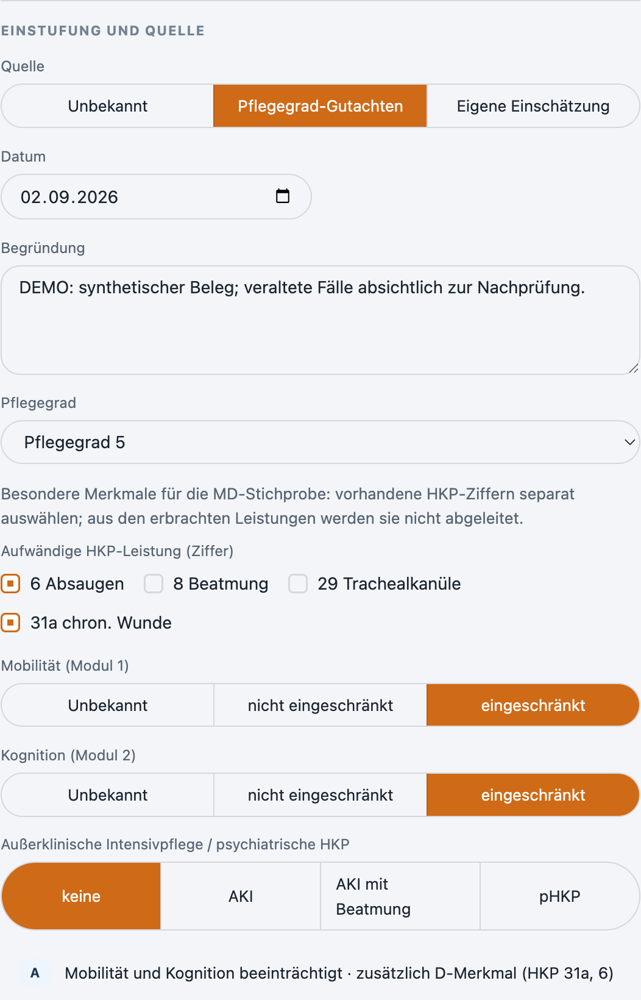
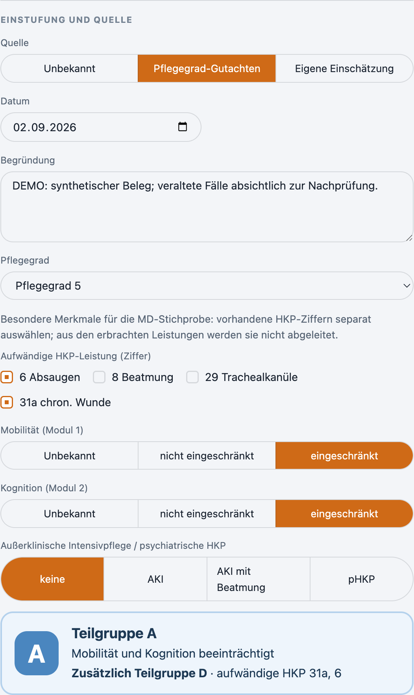
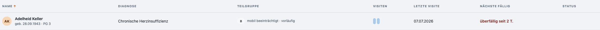
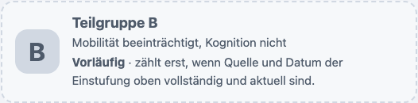

# Teilgruppe sichtbar machen und Altmodell-Kompetenzen abschließen

Rückmeldung vom 07.10.2026 mit zwei Punkten.

## QPR-Teilgruppen

Gewünscht war eine automatische Zuordnung zu A bis D. Diese Ableitung gab es bereits; sie stand aber klein in einer Zeile unter den Auswahlfeldern und wurde übersehen. Das Formular zeigt sie jetzt als hervorgehobene Karte mit großem Buchstaben, Beschreibung und gegebenenfalls dem zusätzlichen D-Merkmal. Bei fehlenden Angaben erscheint eine gestrichelte Karte „Teilgruppe offen“.

Nachtrag: Die Patientenansicht zeigte „Teilgruppe offen“, obwohl Mobilität und Kognition eingetragen waren, weil Datum oder Quelle der Einstufung fehlten. Das Formular zeigte dagegen schon den Buchstaben. Ansicht, Liste und Formular zeigen jetzt einheitlich den abgeleiteten Buchstaben mit dem Zusatz „vorläufig“, solange die Einstufung ungeprüft oder veraltet ist. Zählung, Filter, MD-Personenliste und Export bleiben unverändert und berücksichtigen nur geprüfte Einstufungen.

Die vorgeschlagene Belegung (A = keine Beeinträchtigung, D = beide) weicht von der QPR ab. ClearDeck bleibt bei Kapitel 8.1: A beide beeinträchtigt, B nur Mobilität, C nur Kognition, D zusätzlich bei aufwändiger HKP (ADR 0001). Personenliste und Export nach Anlage 7 bestehen bereits unter **MD-Prüfung**.

## Kompetenzabschluss beim eigenen Profil

ClearDeck kennt keine Benutzerrollen pro Person; Sperren für das eigene Profil gibt es nicht. Ursache sind Kompetenzen aus der Zeit vor dem Einarbeitungsmodell. Sie stehen im Altmodell (Stufen bis „Kann anleiten“) und bieten deshalb keinen Abschluss. Die Sammeländerung konnte sie bisher nicht ins aktuelle Modell überführen.

**Stufe ändern** bietet für Altmodell-Einträge jetzt zusätzlich „Neu einschätzen (aktuelles Modell)“ mit den Stufen 1 bis 6. Die Überführung ist ausdrücklich; der Server prüft weiterhin, dass sich das Stufenmodell seit dem Öffnen nicht geändert hat. Ein Abschluss verlangt Datum und verantwortliche Person; bei Stufen darunter entfallen alte Bestätigungen. Der alte Stand bleibt im Verlauf.

## Prüfung

- 704 Tests in 101 Dateien erfolgreich (Node 26.8.2), darunter sieben neue für Teilgruppen-Karte und Neueinschätzung.
- TypeScript und ESLint ohne Fehler.
- Echte Electron-Demo mit synthetischen Daten: Teilgruppen-Karte bei Bruno Busch; drei Kompetenzen von Anna Beispiel auf das Altmodell gesetzt, gemeinsam neu eingeschätzt und abgeschlossen.

Keine Migration und keine neue Server-Schemaversion.

