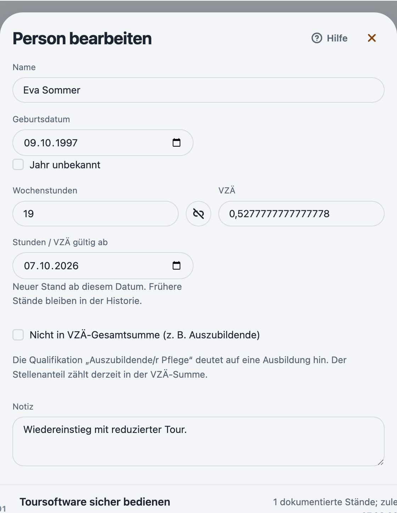
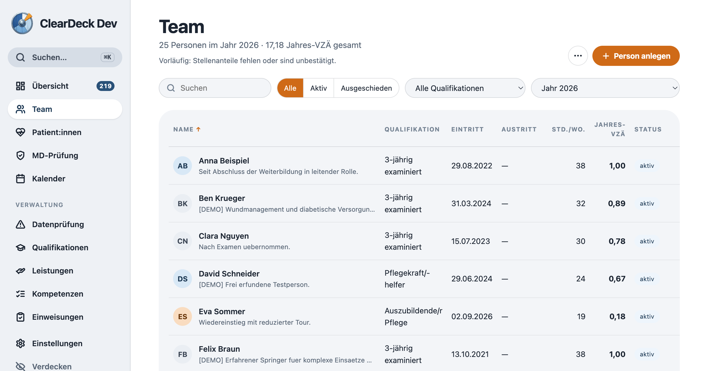

# Auszubildende aus der VZÄ-Gesamtsumme herausnehmen

Rückmeldung vom 07.10.2026: Auszubildende flossen mit ihrem Stellenanteil (z. B. 0,67) in die VZÄ-Gesamtsumme ein. Dort dürfen sie nicht mitzählen.

## Lösung

Neue Spalte `employment_periods.excludeFromFteTotal` (Migration v025, Sync-Schema 25). Die Markierung gilt je Beschäftigungszeitraum: Ein Qualifikationswechsel nach der Ausbildung beginnt einen neuen Zeitraum, ab dem die Person wieder mitzählt. Ein Feld an der Person würde ausgelernte Fachkräfte weiter ausschließen.

- Checkbox „Nicht in VZÄ-Gesamtsumme (z. B. Auszubildende)“ im Personendialog, gilt für den aktuellen Zeitraum.
- Beim Anlegen wird sie für Qualifikationen mit „Azubi“ oder „Auszubildende“ vorgeschlagen, solange sie nicht von Hand geändert wurde.
- Beim Qualifikationswechsel leitet der neue Zeitraum den Wert aus der neuen Qualifikation ab.
- Bestehende Daten werden nicht nachträglich markiert. Sieht die Qualifikation nach Ausbildung aus, nennt der Dialog das als Hinweis.

## Wirkung

- Team-Liste, Dashboard, Jahresnachweis und Excel-Export rechnen markierte Zeiträume nicht in die Summe. Der eigene VZÄ-Wert bleibt sichtbar und ist gekennzeichnet.
- Personenzahlen, Arbeitszeitlogik und der Stellenanteil pro Person bleiben unverändert.

## Prüfung

- 706 Tests in 102 Dateien erfolgreich (Node 26.8.2), darunter Migration ohne Nachtragen, Wechsel Azubi → Fachkraft zur Jahresmitte und Export.
- Server-Tests ohne Fehler; die Postgres-Integration ist opt-in und lief nicht.
- TypeScript und ESLint ohne Fehler.
- Echte Electron-Demo mit synthetischen Daten: Eva Sommer auf „Auszubildende/r Pflege“ gesetzt, Checkbox angehakt. Die Jahres-VZÄ gesamt sinken von 17,18 auf 17,00.

