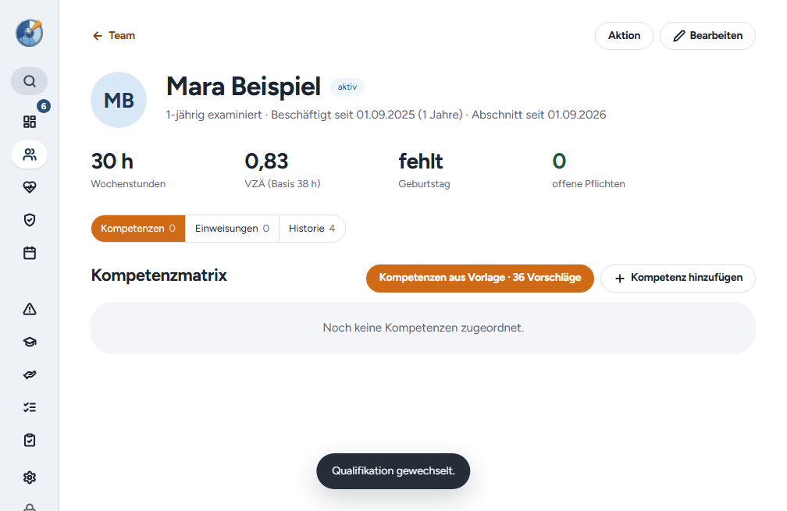

# Windows-Release 2.6.0

Der Release bündelt PR #66 bis #68: Zurück-Link und Aktionszeile auf Personen- und Patientenseiten, ein konkreter Grund für eine vorläufige Teilgruppe sowie keine Fälligkeit mehr nach dem Versorgungsende. [PR #69](https://github.com/tbuck-software/cleardeck/pull/69) bereitet den Release vor.

Die Datenbank bleibt auf Schema 25. Die Sync-Schemaversion ändert sich nicht. Ein Serverdeployment gehört nicht zu diesem Release.

## Prüfung

Die Codeprüfungen umfassen TypeScript, ESLint und die vollständige Testsuite. Acht native Windows-Wege prüfen Installation bzw. Update aus der App, das bisherige Passwort, verschlüsselte Konfiguration und Schlüssel, bestehende Datensätze, Einstellungen und Benutzerpräferenzen über zwei Starts. Ausgangsversionen vor 2.5.0 migrieren auf Schema 25 und erhalten genau eine Migrationssicherung. Ab 2.5.0 gibt es nichts zu migrieren, deshalb entsteht keine Sicherung.

2.1.0 und 2.2.0 werden wie bei 2.5.0 aus dem Originaltag rekonstruiert. 2.2.1 bis 2.5.0 verwenden die Originalinstaller mit archivierter SHA-256. Die Prüfsumme von 2.5.0 stimmt mit dem GitHub-Digest des veröffentlichten Installers überein. Der Nachfolger 2.6.1 dient ausschließlich dem Folgeupdatetest und wird nicht veröffentlicht.

Nach den Bestandsvergleichen wechselt der Test die Qualifikation einer synthetischen Auszubildenden über den sichtbaren Dialog. Neu prüft er danach, dass der Zurück-Link auf der Personenseite „Team“ heißt und zur Teamliste führt. Das bestand auf allen acht Wegen.

| Ausgangspunkt | Weg | Ziel | Migrationssicherungen |
| --- | --- | --- | --- |
| 2.1.0, rekonstruiert | Installer über vorhandene App | 2.6.0 | 1 |
| 2.2.0, rekonstruiert | Installer über vorhandene App | 2.6.0 | 1 |
| 2.2.1 | Update aus der App | 2.6.0 | 1 |
| 2.3.0 | Update aus der App | 2.6.0 | 1 |
| 2.4.0 | Update aus der App | 2.6.0 | 1 |
| 2.4.1 | Update aus der App | 2.6.0 | 1 |
| 2.5.0 | Update aus der App | 2.6.0 | 0 |
| 2.6.0 | Folgeupdate aus der App | 2.6.1, nur Testversion | 0 |

Der Kandidatencommit `c42d33149cc96870819e39df82d440b962c6a675` bestand den [Kandidatenlauf 37967121885](https://github.com/tbuck-software/cleardeck/actions/runs/37967121885) im ersten Versuch.

## Veröffentlichung und Rückprüfung

[Release v2.6.0](https://github.com/tbuck-software/cleardeck/releases/tag/v2.6.0) wurde am 09.10.2026 um 17:57 UTC veröffentlicht. Der [Veröffentlichungslauf 37968438225](https://github.com/tbuck-software/cleardeck/actions/runs/37968438225) bestand im ersten Versuch.

Alle fünf veröffentlichten Dateien wurden erneut heruntergeladen. Ihre SHA-256-Werte stimmen mit dem getesteten Tag-Build und den GitHub-Digests überein. Der lokale Verifier bestätigte Paketinhalt, Referenzen, Größen, SHA-512 und öffentliche/private Update-Provider. Die Release Notes in GitHub und im Update-Manifest entsprechen dem Changelog. Der Release ist stabil, kein Entwurf und als aktuell markiert.

Der Windows-Installer liegt unter `~/Downloads/ClearDeck-2.6.0/ClearDeck-2.6.0-Setup.exe` samt `SHA256SUMS.txt`. Ausgeliefert werden ausschließlich Windows-Dateien. Kein neues Mac- oder Linux-Paket, kein Serverdeployment und kein Test auf Oles Gerät.

Nachweise: [Kandidatenlauf](assets/2026-10-09-release-2.6.0/candidate-run.json), [Veröffentlichungslauf](assets/2026-10-09-release-2.6.0/tag-run.json), [Live-Prüfung](assets/2026-10-09-release-2.6.0/live-verification.json), [Hashvergleich](assets/2026-10-09-release-2.6.0/live-hashes.json), [Releasezustand](assets/2026-10-09-release-2.6.0/live-release.json). Native Ergebnisdateien des Veröffentlichungslaufs liegen unter `published-build/`.

